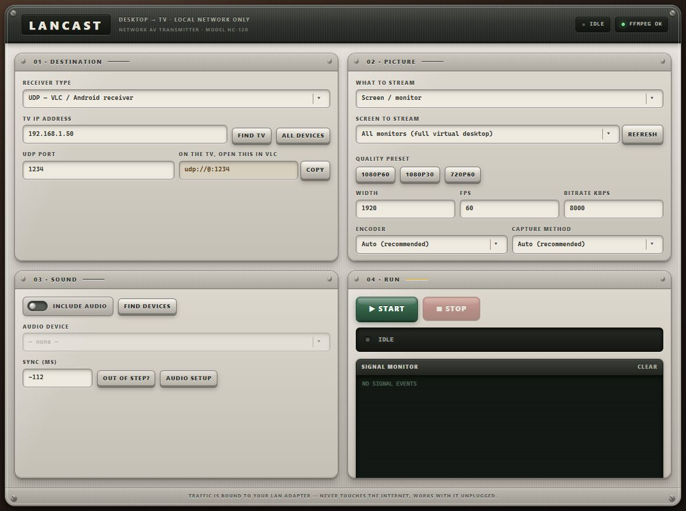

# LANCAST

Stream your Windows desktop to a TV over your own network. No cloud relay, no account, no subscription. The picture goes straight from your PC to your TV across the router, and works with the internet unplugged.



---

## What it does

Your PC captures the screen, encodes it on the GPU, and sends it across your LAN. Use low-latency UDP with VLC or an Android receiver, or open LANCAST's built-in receiver page directly in the LG webOS browser.

- **A whole screen, one monitor, or just one application window**
- **Physical receiver-style interface** with tactile controls and clear signal lights
- **1080p60 with sound**, on hardware that can manage it
- **Local network only** — the stream is bound to your LAN adapter, so it cannot use your internet connection even by accident
- **No LG receiver app required** — HLS mode serves a remote-friendly page to the TV browser
- **ffmpeg comes bundled** — no PATH setup, no separate download
- **LG webOS browser support** — Play, Retry, and Fullscreen controls work with the TV remote
- **One-click updates** — a button appears when a newer public GitHub release is available

## Install

1. Download `LANCAST-Setup-x.y.z.exe` from [Releases](../../releases/latest).
2. Run it.

Windows will likely warn you that the publisher is unrecognised — that happens with any installer that hasn't been signed with a paid certificate, which this isn't. Click **More info → Run anyway** if you're comfortable with that; the source is all here if you'd rather read it or build it yourself.

The installer is for 64-bit Windows 10 or 11. It includes ffmpeg, so the PC
does not need Python, Node.js, or a separate ffmpeg installation. The TV (or
other receiver) only needs VLC and must be on the same local network. An LG TV
can use its built-in web browser instead. Sound is optional; sending Windows
system audio requires a loopback device such as
[VB-Audio Virtual Cable](https://vb-audio.com/Cable/).

Starting with v1.4.1, LANCAST checks its public GitHub Releases feed after launch
and every six hours. When a newer version exists, an **UPDATE TO v…** button
appears in the toolbar. Clicking it downloads the verified release, stops any
active stream, restarts LANCAST, and runs the update automatically. The first
install of v1.4.1 is manual; later releases can update themselves.

## Use it

**On the TV**, choose one of these receiver options:

- **VLC / Android TV receiver:** select **UDP** in LANCAST, open VLC's **Network Stream**, and enter the address LANCAST shows you (usually `udp://@:1234`).
- **LG webOS:** select **HLS** in LANCAST, press **Start**, then open the displayed `http://.../tv` address in the TV's built-in Web Browser.

**On the PC**, open LANCAST:

1. Put in your TV's IP address. **Find TV** searches for it; **All devices** lists everything on your network if that doesn't turn it up. Your TV also shows it under network settings.
2. Under **What to stream**, choose a screen/monitor or one open application window.
3. Pick a quality preset — **1080p60** for screen capture or **1080p30** for a single app window is a good starting point.
4. Press **Start**.

The picture should appear on the TV within a few seconds.

### LG webOS — no TV app required

1. In LANCAST, choose **HLS — LG TV web browser**.
2. Enter the TV's IP address so LANCAST selects the correct local network adapter.
3. Choose the screen or application window and press **Start**.
4. On the LG TV, open **Home → Web Browser** and enter the displayed address, such as `http://192.168.1.20:8090/tv`.
5. Choose **PLAY STREAM**, then **FULLSCREEN**. The page automatically retries while the first HLS segments are being created.

The receiver page, playlist, and video segments are served only from this PC's selected LAN address. It has no external scripts, account, cloud service, or internet dependency. HLS normally has a few seconds more latency than UDP because the TV buffers short segments. The live playlist deliberately uses the conservative HLS v3 tags supported by LG webOS. If Windows Firewall asks, allow LANCAST on **Private networks** only.

## Stream one application

Under **Picture → What to stream**, choose **One application window**, select the
open window, and press **Start**. Only that top-level window is sent, even if it
moves around the desktop. This works with both UDP/VLC and the LG browser receiver.

Single-window capture uses Windows GDI, so 1080p30 is usually a better starting
point than 1080p60. Keep the selected window open and not minimized. Menus,
dialogs, and additional windows belonging to the same application are separate
Windows windows and are not automatically included. Protected/DRM video may
appear black because the application can prevent screen capture.

Video and audio are selected independently. To send only that application's
sound as well, follow **To send just one app** in the Sound section below.

## Sound

Windows has no single "system audio" input, so sound needs one free extra piece: [VB-Audio Virtual Cable](https://vb-audio.com/Cable/). Install it, then:

**To send everything you hear:** set `CABLE Input` as your Windows output device (Settings → Sound → Output), and turn on *Listen to this device* on it in the Recording tab so you still hear things yourself. In LANCAST, tick **Include audio** and choose `CABLE Output`.

**To send just one app:** leave your speakers as the default output. In Settings → System → Sound → Volume mixer, change only that app's output to `CABLE Input`. Everything else keeps playing through your speakers. Choose `CABLE Output` in LANCAST as before.

### If sound and picture are out of step

Use the **Sync (ms)** box. Work out which one is late first, because the sign depends on it:

- Sound arrives **after** the picture → **negative** number (e.g. `-200`), which pulls audio earlier
- Sound arrives **before** the picture → **positive** number (e.g. `200`), which holds audio back

Adjust by 100 until the gap closes, then by 25. If a change makes it clearly worse, the sign is backwards.

The default is `-112`, measured on one real TV. It is not a universal figure — it depends on how long your particular TV buffers video before displaying it — so expect to retune it. It's saved once you find it.

## If something's wrong

**The picture is cropped or zoomed in.** This should not happen any more, but if it does, press **Refresh** next to the screen picker — the sizes listed should match your monitors' real resolutions. Windows reports scaled-down sizes to apps that haven't opted out of display scaling, and ffmpeg captures in real pixels, so a mismatch makes it grab only a corner of the screen.

**The frame rate is poor.** Check the status line while streaming — it names the capture method. **GDI** copies every frame through your CPU (about 8 MB per frame at 1080p, roughly half a gigabyte per second at 60fps) and often cannot hold 60fps. Single-window capture requires GDI. **Desktop Duplication** takes a complete display frame from the GPU instead and is dramatically faster. LANCAST tries Desktop Duplication first for screen capture and falls back to GDI, saying why in the log. If you're using GDI, drop to 1080p30.

**The picture freezes for a moment now and then.** The stream is plain UDP with no retransmission, which is what keeps it fast. A dropped packet — normal on Wi-Fi — costs up to half a second before the next keyframe restores the picture. Lower the bitrate, or put the TV on Ethernet.

**Nothing arrives at the TV.** Check the selected receiver mode and port. In UDP mode, the VLC port must match. In HLS mode, press Start before opening the browser address and allow LANCAST through Windows Firewall on **Private** networks. Confirm the address ends in `/tv`; press **RETRY** once the PC says it is streaming. Some routers block client-to-client traffic ("AP isolation" or "client isolation") — that has to be turned off in the router.

## Build it yourself

Install [Node.js 22 or newer](https://nodejs.org/), then run:

```bash
git clone https://github.com/Melqandil/Nocablecast.git
cd Nocablecast
npm ci
npm run fetch:ffmpeg    # downloads the ffmpeg binary to bundle
npm run dev             # run in development
npm run dist            # produce a Windows installer in release/
```

`npm run typecheck`, `npm test`, and `npm run build` are the same checks run by
CI. `npm run dist` produces a shareable installer in `release/`; the installed
app has no Node.js or ffmpeg prerequisite. Pushing a version tag (for example
`v1.0.1`) performs the same installer build on a Windows GitHub Actions runner
and attaches it to a GitHub release.

## How it works

```
Screen ──▶ Desktop Duplication (GPU) ──┐
                                        ├──▶ H.264 ──┐
App window ──▶ GDI ────────────────────┘             │
                                                      ├──▶ MPEG-TS ──▶ UDP ──▶ VLC / Android
Audio ──▶ DirectShow (50ms chunks) ──▶ AAC ──────────┤
                                                      └──▶ HLS over HTTP ──▶ LG web browser
```

Two decisions carry most of the quality, and both were learned the hard way:

**The video half of the ffmpeg command is identical whether or not audio is enabled.** Combining a screen and a sound source tempts you into ffmpeg's global timestamp and frame-pacing options (`-use_wallclock_as_timestamps`, `-max_interleave_delta`, `-fps_mode`, `-async`). Those act on the *video* stream too, and throttled it to roughly one frame per second the moment audio was switched on. Audio drift is corrected only on the audio side, where it cannot slow video down. There is a test that fails if this ever regresses.

**Audio latency is set at capture, not compensated afterwards.** DirectShow hands audio over in chunks and nothing can be sent until a chunk fills, so chunk size is a hard latency floor. The device default is commonly 500ms — enough on its own to put sound clearly behind the picture. LANCAST asks for 50ms.

`legacy/` holds the original Python version this grew out of. It still works, and the test suite pins the new implementation's ffmpeg output to it exactly, across 72 configurations — it is the reference for every tuned value here.

## Licence

GPL-3.0. LANCAST bundles [ffmpeg](https://ffmpeg.org/), which is licensed under the GPL/LGPL; the bundled build is fetched from [gyan.dev](https://www.gyan.dev/ffmpeg/builds/) with [BtbN](https://github.com/BtbN/FFmpeg-Builds) as a fallback at build time, and is not redistributed in this repository.
